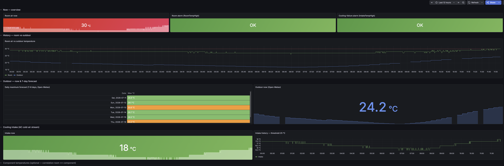

# Grafana Climate Monitoring


**Know before the room cooks.** A small, self-hosted setup that watches a server
room, a network cabinet, a homelab shelf or a garage rack for a cooling failure
and catches it while the room average is still unchanged, using a Grafana
dashboard, Prometheus alerts, and a USB temperature probe in the AC cold-air
stream.



## The idea

Room-average temperature is a *lagging* signal: by the time the whole room is
warm, the air conditioner has been dead for a while. The trick is to put a USB
probe **directly in the cold-air stream** of the AC unit. When cooling
fails, that stream warms almost immediately, while the room average is still
where it was.

This project combines three temperature sources into one picture:

- **Cold-air intake** (USB probe) — the *fast* cooling-failure signal.
- **Room air** (an on-board `hwmon` sensor node_exporter already sees) — the
  *broad* signal.
- **Outdoor** (Open-Meteo, free, no API key) — *context*: is the room warming
  because the AC failed, or because it is 38 °C outside?

Everything is plain files: shell scripts, systemd timers, a Prometheus rules
file, and a Grafana dashboard JSON. No database, no daemon of its own, no
account anywhere.

## How it works

```
╔══ host near the rack ════════════════════════════════════╗
║                                                          ║
║  USB probe ──▶ ╭──────────────────────╮                  ║
║  (AC stream)   │ read-usb-temp-sensor │──┐               ║
║                ╰──────────────────────╯  │               ║
║                                          ▼   .prom        ║
║  Open-Meteo ─▶ ╭──────────────────────╮  textfile        ║
║  (outdoor)     │ fetch-outdoor-temp   │─▶ collector       ║
║                ╰──────────────────────╯  │               ║
║                                          ▼               ║
║  on-board hwmon ──────────────▶ ┌──────────────────┐     ║
║  (room air)                     │ node_exporter    │     ║
║                                 │ :9100            │     ║
║                                 └────────┬─────────┘     ║
╚══════════════════════════════════════════│══════════════╝
                                           │ scrape
                                           ▼
                    ┌────────────┐   ┌────────────────┐
                    │ Prometheus │──▶│    Grafana     │
                    │ + alerts   │   │ climate board  │
                    └─────┬──────┘   └────────────────┘
                          │ fires
                          ▼
                    Alertmanager ──▶ your email / chat
```

## What's in the box

```
scripts/
  read-usb-temp-sensor.sh     USB serial probe → Prometheus gauge
  fetch-outdoor-temp.sh       Open-Meteo → Prometheus gauge
systemd/
  climate-usb-sensor.*        service + timer (every 60 s)
  climate-outdoor-temp.*      service + timer (every 15 min)
prometheus/alerts/
  climate-alerts.yml          RoomTempHigh, IntakeTempHigh, IntakeSensorDown, …
grafana/
  dashboards/climate.json     the dashboard
  provisioning/               datasources (pinned uid) + dashboard provider
alertmanager/                 optional e-mail alerting
  alertmanager.example.yml    route + receiver (SMTP placeholders)
  templates/                  layperson-friendly HTML/text mail template
docs/
  HARDWARE.md                 sensor choices, finding your hwmon sensor
  INSTALL.md                  full step-by-step deployment
  OPEN_METEO_GRAFANA.md       the forecast-table recipe (Infinity + JSONata)
  TROUBLESHOOTING.md          symptom → cause → fix
```

## Quick start

You need an existing Prometheus + Grafana + `node_exporter` (with the textfile
collector). Then, on the host near the rack:

```bash
sudo install -m 0755 scripts/*.sh /usr/local/sbin/
sudo install -m 0644 systemd/* /etc/systemd/system/
sudo systemctl daemon-reload
sudo systemctl enable --now climate-usb-sensor.timer climate-outdoor-temp.timer
```

Load the alerts, provision the dashboard, set your location and sensor — the
full walkthrough is in **[docs/INSTALL.md](docs/INSTALL.md)**. Something not
showing up afterwards? See **[docs/TROUBLESHOOTING.md](docs/TROUBLESHOOTING.md)**.

## Metrics

| Metric | Source | Meaning |
|---|---|---|
| `node_hwmon_temp_celsius` | node_exporter | room air (your chosen hwmon sensor) |
| `climate_intake_temp_celsius` | `read-usb-temp-sensor.sh` | AC cold-air stream |
| `climate_intake_fetch_success` | ″ | last read ok (1) / failed (0) |
| `climate_intake_last_check_timestamp_seconds` | ″ | freshness of the reading |
| `climate_outdoor_temp_celsius` | `fetch-outdoor-temp.sh` | outdoor reference |

The two `intake` liveness gauges exist for a reason: if the reader stops, the
textfile collector keeps serving the last value **forever**, so a plain
"temperature is fine" check would be blind to a dead sensor. The `IntakeSensorDown`
alert combines a read-failure check *and* a staleness check to catch both cases.

## Alerts

| Alert | Fires when | Severity |
|---|---|---|
| `RoomTempHigh` | room air over the limit for 10 min | warning |
| `IntakeTempHigh` | AC cold-air stream over the limit for 10 min | warning |
| `IntakeSensorDown` | probe read fails **or** goes stale > 10 min | warning |
| `OutdoorFetchStale` | outdoor reference stale > 1 h (cosmetic) | info |

Thresholds in `prometheus/alerts/climate-alerts.yml` are starting points. Log a
few days of normal operation, then set them a few degrees above your baseline.

Want e-mail notifications? Wire up Alertmanager with the optional templates in
`alertmanager/` — a layperson-friendly mail showing the current value, the
threshold, and a one-click dashboard button. See
**[docs/INSTALL.md](docs/INSTALL.md)** step 5.

## Configuration

Both scripts read their settings from environment variables (set them in the
systemd unit's `Environment=` lines):

| Variable | Default | Used by |
|---|---|---|
| `SENSOR_DEV_GLOB` | `/dev/serial/by-id/*-if00-port0` | USB reader |
| `SENSOR_BAUD` | `9600` | USB reader |
| `READ_TIMEOUT` | `3` | USB reader |
| `LATITUDE` / `LONGITUDE` | Berlin city centre | outdoor reader |
| `OPEN_METEO_MODEL` | `dwd-icon` | outdoor reader |
| `TEXTFILE_DIR` | `/var/lib/node_exporter/textfile_collector` | both |

Three values are fixed in the scripts themselves: the sanity bounds `TEMP_MIN`
(-40) and `TEMP_MAX` (100) in `scripts/read-usb-temp-sensor.sh`, which reject
electrical glitches, and the curl `TIMEOUT` (10 s) in
`scripts/fetch-outdoor-temp.sh`. A probe operating outside that range, or a slow
link, needs an edit in the script.

Two further couplings are **not** driven by these variables either and need a
manual edit:

- **`METRIC_PREFIX`** (default `climate_intake` / `climate_outdoor`) is settable,
  but the metric names are also hardcoded in `prometheus/alerts/climate-alerts.yml`
  and `grafana/dashboards/climate.json`. Change it in one place, change it in all three.
- **The forecast table's location** lives in the dashboard JSON, not in
  `LATITUDE`/`LONGITUDE` (those only drive the Prometheus-fed panels). Edit the
  `url` field of the "Daily maximum forecast" panel to your own coordinates.

## Requirements

- Prometheus, Grafana (10+ — the forecast table uses the 10.x table cell API),
  and `node_exporter` with the textfile collector
- `bash`, `curl`, `jq`, `stty`, GNU coreutils on the sensor host
- Grafana plugin `yesoreyeram-infinity-datasource` (only for the forecast table)

## License

MIT — see [LICENSE](LICENSE).
